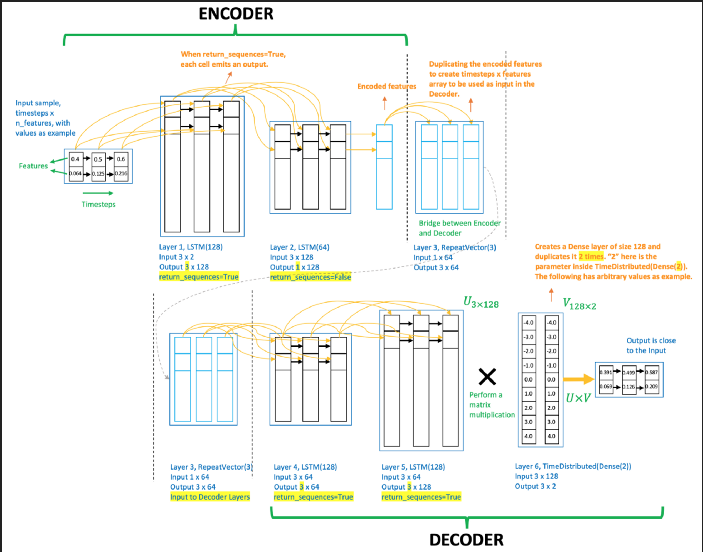
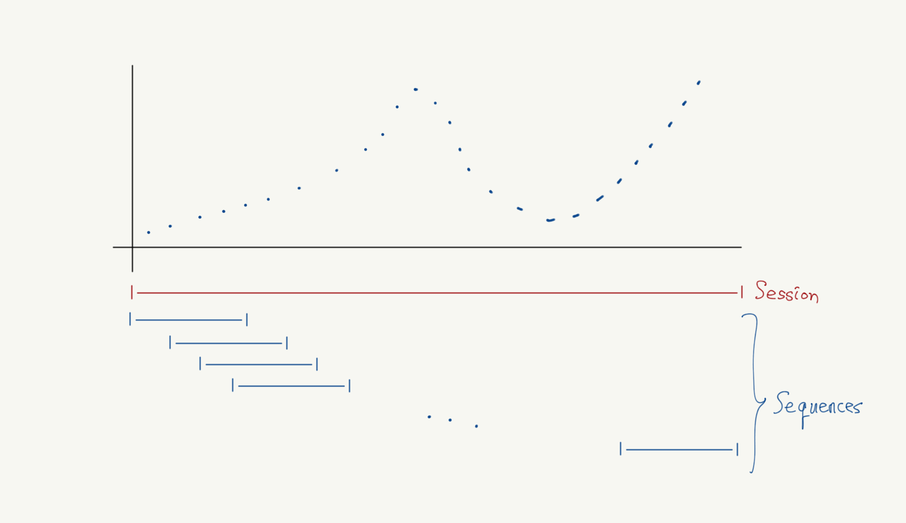

# 실시간 센서 데이터 이상치 탐지 시스템
인하대학교 24-2 종합설계 3조 닥트리오 프로젝트의 이상치 탐지 모델에 대한 구현 코드입니다. 
LSTM-AutoEncoder를 이용해 여러 스트리밍 데이터에 대한 이상치를 탐지하여 서버사이드로 알림 발송 여부를 전하게 됩니다. 

---
## 1. :mag_right:이상치 탐지란?

### 1.1. 이상치 탐지의 정의
이상치 탐지(Anomaly Detection)는 데이터 세트에서 예상되는 정상적인 패턴과 다른 특이한 패턴이나 항목을 식별하는 프로세스입니다. 산업 현장에서는 이러한 이상치 탐지를 통해 장비의 고장을 예측하거나 품질 이상을 조기에 발견할 수 있습니다.

### 1.2. 이상치의 특성과 이상치 탐지가 어려운 이유
이상치 탐지에는 다음과 같은 어려움이 있습니다:

- **정의의 어려움**: 어떤 종류의 데이터를 '이상치'라고 판단할 것인지 어렵습니다. 
- **희귀성(Rarity)**: 이상 데이터는 매우 드물게 발생하여 학습 데이터 확보가 어렵습니다.
- **불균형(Imbalance)**: 정상 데이터와 이상 데이터 간의 심각한 불균형이 존재합니다.
- **동적 특성**: 정상의 기준이 시간에 따라 변할 수 있습니다.
- **노이즈 구분**: 실제 이상과 일시적인 노이즈를 구분하기 어렵습니다.

### 1.3. 이상치 탐지 기법의 종류
1. **통계적 방법**
   - 평균, 표준편차 기반 방법
   - 마할라노비스 거리

2. **근접성 기반 방법**
   - K-Nearest Neighbors
   - Local Outlier Factor (LOF)

3. **머신러닝 기반 방법**
   - One-Class SVM
   - Isolation Forest
   - AutoEncoder

이 중 저희 프로젝트에선 AutoEncoder를 이용한 이상치 탐지 기법을 이용해 볼 것입니다. 

## 2. :arrows_counterclockwise:AutoEncoder

### 2.1. AutoEncoder란?

   


AutoEncoder는 비지도 학습 신경망으로, 입력 데이터를 압축(인코딩)했다가 다시 복원(디코딩)하는 과정을 통해 데이터의 중요 특징을 학습합니다. 

모델은 들어온 입력을 입력보다 더 적은 수의 차원(노드)으로 표현한 다음, 이를 동일한 차원의 데이터로 최대한 온전히 복원하도록 학습되어, 입력 데이터의 숨겨진 저차원 특성을 학습하도록 되어 있습니다. 

쉽게 설명하자면 데이터의 특성을 "잘 요약"하도록 학습함으로써 데이터의 패턴을 이해하도록 하는 모델입니다. 


### 2.2. AutoEncoder를 이용한 이상치 탐지의 원리
위 내용을 이상치 탐지에 어떻게 활용할 수 있을까요? 
바로 "학습한 데이터만은 잘 복원할 것이다" 즉, "학습하지 못한 낯선 이상치는 잘 복원하지 못할 것이다"가 주요 아이디어입니다.

정상 데이터로만 학습되어, 이상 데이터가 입력되면 높은 복원 오차를 보이는 특성을 이용해 이상을 탐지합니다.

1. **학습 단계**
   - 정상 데이터만을 사용하여 모델을 학습
   - 데이터 압축-복원 과정을 통해 정상 패턴 학습

2. **탐지 단계**
   - 새로운 데이터의 복원 오차 계산
   - 설정된 임계값보다 높은 복원 오차를 보이면 이상으로 판단

(사실 위 명제는 엄밀히 말하면 사실이 아닙니다. '학습 데이터를 잘 복원한다'는 게 '학습하지 못한 데이터를 잘 복원하지 못한다'와 동치는 아니지요. 하지만 이 부분은 프로젝트 특성상 큰 영향을 미치지 않을 것으로 예상되어 생략합니다. 이에 대해 더 자세히 알고 싶으신 분은 아래 유튜브 영상을 참고하시기 바랍니다)

[https://www.youtube.com/watch?v=_gstnP6EfzY&t=6686s](https://www.youtube.com/watch?v=_gstnP6EfzY&t=6686s)

---

## **3. :chart_with_upwards_trend:LSTM-AutoEncoder, 그리고 세션과 시퀀스의 개념**

### 3.1. LSTM-AutoEncoder의 구조 및 원리

AutoEncoder는 이미지나 표와 같은 고정된 크기의 데이터를 처리하는 데 적합하지만, 시간에 따라 변화하는 시퀀스 데이터(예: 시계열 데이터, 텍스트, 음성)를 처리하는 데는 한계가 있습니다.

시퀀스 데이터의 특징:
데이터 포인트 간의 순서와 시간적 의존성이 중요합니다.
이전 상태가 현재 상태에 영향을 미칩니다.

LSTM-AutoEncoder는 시계열 데이터의 특성을 고려한 구조를 가집니다:

```
Input Sequence → LSTM Encoder → Latent Vector → LSTM Decoder → Output Sequence
```



- **LSTM 인코더(Encoder)**:

  - LSTM 레이어를 사용하여 입력 시퀀스를 압축합니다.
  - 마지막 타임스텝의 출력은 시퀀스 전체의 압축된 표현입니다.

- **Latent Vector(Repeat Vector)**: 위 인코더의 마지막 출력인 시퀀스의 핵심 특성을 포함하는 압축된 표현입니다. 

- **LSTM 디코더(Decoder)**:

  - RepeatVector를 사용하여 압축된 표현을 시퀀스 길이만큼 복제합니다.
  - LSTM 레이어를 사용하여 시퀀스를 복원합니다.
  - TimeDistributed(Dense)를 통해 각 타임스텝의 출력을 얻습니다.

### **3.2. 세션(Session)과 시퀀스(Sequence)**



#### **세션(Session)**
- **세션**은 데이터 수집의 **연속적인 기간**을 의미합니다.
- 모터를 한 번 구동하여 수집한 데이터 집합이 하나의 세션이 됩니다.
- 다른 세션 간에는 **시간적 연속성이 없습니다**. 즉, 세션이 끝나면 다음 세션은 별도의 시간대에서 시작됩니다.
#### **시퀀스(Sequence)**
- **시퀀스**는 LSTM 모델이 한 번에 처리하는 **연속된 데이터 포인트의 집합**입니다.
- 시퀀스 길이(sequence length)는 모델 설계 시 결정하며, 예를 들어 50개의 타임스텝으로 구성될 수 있습니다.
- **중요한 점**: 시퀀스는 **세션 내에서만 생성**되며, **세션 경계를 넘어가지 않습니다**.

### **3.3. 데이터 구조와 흐름**

#### **3.3.1. 데이터 구조**

- **데이터 포인트**: 각 데이터 포인트는 시간에 따른 데이터 값으로 구성됩니다.
- **세션별 데이터**: 여러 세션이 있으며, 각 세션은 연속된 데이터 포인트의 집합입니다.

##### **예시**

- **Session 1**: 데이터 포인트 0 ~ 299
- **Session 2**: 데이터 포인트 0 ~ 399
- **Session 3**: 데이터 포인트 0 ~ 249
- ...

#### **3.3.2 시퀀스 생성**

- 각 세션에서 **시퀀스를 생성**합니다.
- 시퀀스 길이가 50이라고 가정하면, 각 세션에서 가능한 시퀀스의 수는 `(세션 데이터 포인트 수) - 시퀀스 길이 + 1`입니다.

#### **Session 1 예시**

- **시퀀스 1**: 데이터 포인트 0 ~ 49
- **시퀀스 2**: 데이터 포인트 1 ~ 50
- ...
- **시퀀스 250**: 데이터 포인트 249 ~ 298


### **3.4. 모델의 input에 사용되는 요소

위 세션을 시퀀스 길이만큼 잘라 시퀀스 모음을 만들며, 
LSTM-AutoEncoder는 하나의 **시퀀스**가 들어가게 됩니다. 
하나의 시퀀스, 즉 **하나의 데이터 경향성**을 보고 모델은 이를 똑같이 재구성하도록 학습하게 됩니다. 학습 과정에선 batch-size의 개수만큼의 시퀀스들이 병렬적으로 입력됩니다. 

한 세션에서 만들 수 있는 가능한 모든 시퀀스를 만든 뒤, 이를 모델이 학습하여 세션 내 모든 순간에서의 경향성을 학습합니다. 

이를 여러 세션에 대해 수행하면, 원본 정상 데이터의 흐름 및 경향성을 학습할 수 있습니다. 


---


## 4. 🤖실시간 이상치 탐지 서비스로의 적용

### 4.1. LSTM-AutoEncoder의 입력과 출력 형태
```python
Input shape: (batch_size, sequence_length, n_features)
Output shape: (batch_size, sequence_length, n_features)
```

- **sequence_length**: 설정된 시퀀스 길이 (예: 100 타임스텝)
- **n_features**: 입력 특성의 수 (예: 진동 데이터의 경우 3축 가속도)

### 4.2. LSTM-AutoEncoder의 모델 학습 원리

1. **데이터 전처리**
   - 시계열 데이터 정규화
   - 슬라이딩 윈도우 방식으로 시퀀스 생성

2. **모델 학습**
   - 입력과 동일한 출력을 목표로 학습
   - Mean Squared Error (MSE) 손실 함수 사용

### 4.3. LSTM-AutoEncoder의 테스트 원리
1. **이상치 판단**
   - 복원 오차가 임계값을 초과하면 이상으로 판단
   - F2-Score를 통한 모델 성능 평가 (재현율에 더 큰 가중치)

2. **임계값 설정**
   - 정상 데이터의 복원 오차 분포를 기반으로 설정
   - 운영 환경에 따라 조정 가능

### 4.4. 실서비스를 위한 구현
1. **스트리밍 서버**
   - 실시간 데이터 수신 및 전처리
   - 모델 추론 및 결과 전송

2. **시각화 서버**
   - 실시간 모니터링 대시보드
   - 이상 감지 시 알림 기능

---
## 5. :open_file_folder:프로젝트 구조

```
anomaly_detection_project/
├── codes                     # 코드 모음
│   ├── models/                  # 모델 정의 함수
│   ├── utils/                   # 설정값 및 데이터 로드 함수 
│   ├── training/                # train 함수 정의
│   ├── tests/                   # test 함수 및 test 데이터 구축 함수 정의
│   ├── visualization/           # 시각화 코드 정의
├── datas/                    # 데이터 저장소
│   ├── raw/                     # 원본 데이터
│   │   ├── rpm_600/                # 600RPM 데이터
│   │   │   ├ train/                   # train 데이터
│   │   │   └ test/                    # test 데이터
│   │   └── rpm_1200/               # 1200RPM 데이터
│   │       ├ train/                   # train 데이터
│   │       └ test/                    # test 데이터
│   └── processed/               # 전처리된 데이터
├── images/                   # 마크다운용 이미지
├── models/                   # 모델 파일 저장 디렉토리
├── 개발과정정리/                # 개발 과정에서 따로 조사하거나 공부한 내용 정리
├── .gitignore                
├── LICENSE            
├── README.md           
└── requirements.txt               
```


---


## 6. :twisted_rightwards_arrows:프로젝트 진행에 따른 데이터의 흐름

### 6.1. 학습 전 데이터 흐름

1. **데이터 수집**: 각 세션에서 모터 구동 시 수집된 가속도 데이터를 확보합니다.

2. **데이터 전처리**:

   - **스케일링**: 모든 세션의 데이터를 합쳐서 `MinMaxScaler`나 `StandardScaler`를 사용하여 정규화합니다.
   - **결측치 처리**: 결측치가 있다면 제거하거나 보간합니다.

3. **시퀀스 생성**:

   - 각 세션별로 시퀀스를 생성합니다.
   - 시퀀스는 **세션 내의 데이터로만 구성**됩니다.
   - 생성된 시퀀스는 **3차원 배열**로 저장됩니다: `(총 시퀀스 수, 시퀀스 길이, 특징 수)`

4. **모델 학습**:

   - 생성된 모든 시퀀스를 사용하여 LSTM-AutoEncoder 모델을 학습합니다.
   - 모델은 입력 시퀀스를 압축하고 다시 복원하는 과정을 통해 **정상 패턴을 학습**합니다.


### 6.2. 학습 시 데이터 흐름

1. **입력과 출력**:

   - 입력: 시퀀스 `(batch_size, sequence_length, features)`
   - 출력: 입력과 동일한 시퀀스

2. **손실 함수**:

   - **Mean Squared Error(MSE)**를 사용하여 입력 시퀀스와 복원된 시퀀스 간의 차이를 최소화합니다.

3. **학습 목표**:

   - 모델이 정상적인 시계열 패턴을 학습하여 입력 시퀀스를 정확하게 복원하도록 가중치를 조정합니다.

### **6.3 세션과 시퀀스의 관계**

- **세션별 학습 데이터**:

  - 각 세션에서 생성된 시퀀스들은 모델 학습 시 **독립적으로 처리되지 않고**, **전체 학습 데이터의 일부**로 사용됩니다.
  - 모델은 다양한 세션의 데이터를 통해 **다양한 정상 패턴**을 학습합니다.

- **시간적 의존성 유지**:

  - 시퀀스는 세션 내에서 시간적 순서를 유지하므로, LSTM이 시간적 패턴을 학습할 수 있습니다.
  - 세션 간의 불연속성은 시퀀스 생성 시 고려되므로, 모델 학습에 영향을 주지 않습니다.

---

## **7. :memo:예시를 통한 데이터 흐름 설명**

### **7.1 데이터 준비**

- **Session 1 데이터** (`session1_data`):

  ```
  Index | acc_x | acc_y | acc_z
  --------------------------------
    0   | 0.1   | 0.2   | 0.15
    1   | 0.11  | 0.19  | 0.16
    ... (중략)
    299 | 0.12  | 0.18  | 0.14
  ```

- **Session 2 데이터** (`session2_data`):

  ```
  Index | acc_x | acc_y | acc_z
  --------------------------------
    0   | 0.09  | 0.21  | 0.13
    1   | 0.1   | 0.2   | 0.14
    ... (중략)
    399 | 0.11  | 0.19  | 0.15
  ```

### **7.2 시퀀스 생성 예시**

- **시퀀스 길이**: 50

- **Session 1의 시퀀스 생성**:

  - **시퀀스 1**:

    ```
    [ [0.1, 0.2, 0.15],
      [0.11, 0.19, 0.16],
      ... (중략)
      [데이터 포인트 49] ]
    ```

  - **시퀀스 2**:

    ```
    [ [0.11, 0.19, 0.16],
      [데이터 포인트 2],
      ... (중략)
      [데이터 포인트 50] ]
    ```

  - 총 생성 가능한 시퀀스 수: 300 - 50 + 1 = 251개

### **7.3 모델 학습 데이터 구성**

- **학습 데이터 `X_train`**:

  - Session 1의 시퀀스 251개
  - Session 2의 시퀀스 350개 (400 - 50 + 1)
  - ...
  - 모든 세션의 시퀀스를 합쳐서 총 `N`개의 시퀀스로 구성된 `(N, 50, 3)` 형태의 배열

### **7.4 모델 학습 단계**

1. **Forward Pass**:

   - 각 배치의 시퀀스가 인코더를 통과하여 압축된 표현으로 변환됩니다.
   - 디코더를 통해 시퀀스가 복원됩니다.

2. **손실 계산**:

   - 입력 시퀀스와 복원된 시퀀스 간의 MSE를 계산합니다.

3. **Backward Pass**:

   - 손실을 최소화하도록 모델의 가중치를 업데이트합니다.

4. **반복**:

   - 모든 배치를 처리할 때까지 위 과정을 반복합니다.
   - 에포크(epoch) 수만큼 학습을 진행합니다.

---
## 8. :bar_chart:모델 테스트 과정 

### 8.1. 테스트 데이터 구축(라벨링 및 이상치 발생)
1. **테스트 세션에 대한 레이블 모두 0으로 초기화**
   - 수집 데이터는 모두 정상 데이터이기 때문에 정상으로 라벨링을 우선 시행합니다. 

2. **랜덤 이상치 생성 및 레이블 1로 설정**
   - 랜덤한 위치(일정 범위)의 데이터 포인트들이 특이값이 되도록 연산을 주어 이상치로 만든 뒤, 레이블을 1로 수정합니다. 
   - 실제 세계의 이상 상황을 잘 구현하도록 특이값을 만들어내는 것이 관건입니다.
   - 또한 너무 좁은 범위의 데이터들을 이상치로 만들면 현실 세계를 잘 반영하지 못할 수 있습니다. 

### 8.2. F2-Score 계산
   - 테스트 데이터에 대한 이진 분류 문제를 수행한 뒤 F2 Score를 계산합니다.
   - F2 Score를 사용하는 이유는 이상치 탐지 분야의 특성상 False Positive를 감수하더라도 False Negative를 줄이는 것이 중요하기 때문입니다. 

---

## **9. :heavy_exclamation_mark:이상치 탐지 과정**

### **9.1 재구성 오류 기반 이상치 탐지**

- **재구성 오류 계산**:

  - 새로운 데이터 시퀀스를 모델에 입력하고, 복원된 시퀀스를 얻습니다.
  - 입력 시퀀스와 복원된 시퀀스 간의 MSE를 계산하여 재구성 오류를 구합니다.

- **임계값 설정**:

  - 학습 데이터나 검증 데이터의 재구성 오류 분포를 기반으로 임계값을 설정합니다.
  - 일반적으로 재구성 오류가 임계값을 초과하면 이상치로 간주합니다.

### **9.2 실시간 데이터 처리 흐름**

1. **데이터 수신**:

   - 모터에서 실시간으로 가속도 데이터를 수집합니다.

2. **시퀀스 버퍼링**:

   - 일정량의 데이터 포인트를 버퍼에 저장하여 시퀀스를 구성합니다.
   - 버퍼가 시퀀스 길이에 도달하면 모델에 입력합니다.

3. **모델 예측 및 이상치 판단**:

   - 모델을 통해 시퀀스를 복원하고 재구성 오류를 계산합니다.
   - 재구성 오류가 임계값을 초과하는지 확인합니다.

4. **결과 처리**:

   - 이상치로 판단되면 알람 또는 로그를 생성합니다.
   - 버퍼를 업데이트하여 다음 시퀀스를 준비합니다.

---

## **10. :white_check_mark:요약 및 결론**

- **LSTM-AutoEncoder의 학습 원리**는 입력 시퀀스를 압축하고 복원하는 과정을 통해 **정상적인 시계열 패턴을 학습**하는 것입니다.
- **세션과 시퀀스의 관계**:

  - 세션은 데이터 수집의 연속된 기간이며, 시퀀스는 세션 내에서 연속된 데이터 포인트로 구성됩니다.
  - 시퀀스는 세션 경계를 넘어가지 않도록 생성하여 LSTM이 시간적 패턴을 정확히 학습하도록 합니다.

- **데이터 구조와 흐름**은 세션별로 데이터를 관리하고, 각 세션에서 시퀀스를 생성하여 모델 학습에 사용합니다.
- **이상치 탐지**는 모델이 정상 패턴을 기반으로 입력 시퀀스를 복원할 때 재구성 오류를 계산하여 수행됩니다.

---

## **추가 참고 사항 및 참고 자료**

- **데이터 다양성**: 여러 세션의 데이터를 학습에 활용함으로써 모델이 다양한 정상 상태를 학습하게 되어 이상치 탐지의 신뢰성이 높아집니다.
- **모델 일반화**: 세션 간의 차이를 모델이 학습함으로써 새로운 세션에서도 정상과 이상을 효과적으로 구분할 수 있습니다.
- **실시간 적용**: 실시간 데이터 스트림에서도 버퍼를 사용하여 시퀀스를 구성하고 이상치를 탐지할 수 있습니다.
- **AutoEncoder 기반 이상치 탐지 이론**: https://www.youtube.com/watch?v=_gstnP6EfzY&t=6686s